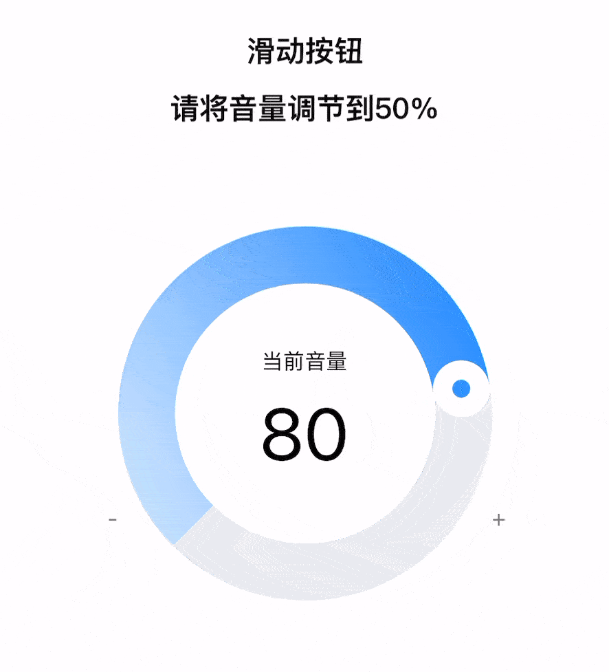

# DraggableProgressCircle 拿过去直接用吧！ 如果好用给个 Star ！

####

<div style="display: flex; justify-content: space-between;">
   
   
</div>

### 核心方法

```swift
    @objc func handlePan(_ gestureRecognizer: UIPanGestureRecognizer) {
        let translation = gestureRecognizer.translation(in: view)
        switch gestureRecognizer.state {
        case .changed:
            let radius = view_W / 2 - 17.5
            let center = arcRingView.center
            let dx = imageView.center.x + translation.x - center.x
            let dy = imageView.center.y + translation.y - center.y
            let angle = atan2(dy, dx)
            imageView.center = CGPoint(x: center.x + radius * cos(angle), y: center.y + radius * sin(angle))
            arcRingView.endAngle = angle
            gestureRecognizer.setTranslation(.zero, in: view)
        default:
            break
        }
    }
```

## 如有问题或疑问，请通过电子邮件或 QQ 联系我！

##### If you have any questions or concerns, please contact me via email or QQ!

E-mail：matsonga@163.com
QQ：937496430
